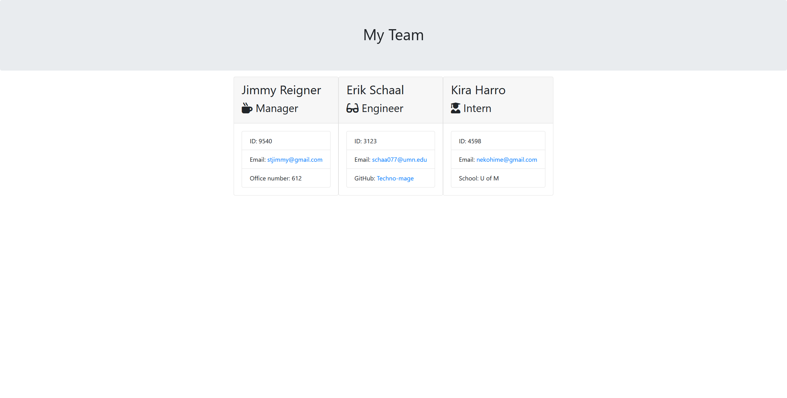

# TeamProfileGenerator

## Author

Erik schaal

## Description

This node application will generate an HTML file that will diplay the profiles of a team of developers.

## Install

* to install the necessary dependencies. run npm
```
npm install
```

## Usage

* to run the program, run the following command

```
node app.js
```

* you will then be prompted with a series of questions regarding your employee's.

## tests

* a series of tests have been provide for testing this software, using the jest testing suite. You can run these tests with the following command.

```
npm run test
```

## Sample

* A sample HTML generated by this application can be found in the sample folder. 



## Demo

* a link to a demo video has been provided Here

https://drive.google.com/file/d/1h9c7VKNDAhA5S7_K5XHy8MtXGj20Kf00/view?usp=sharing